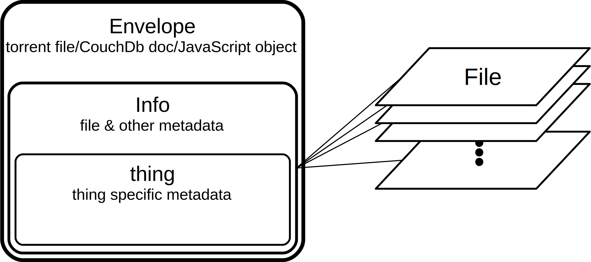

***things* Architecture**

Overview
========

The *things* application is a client-server system intended to create, manage and share *thing* objects. A *thing* is a torrent file with additional metadata as specified by the [Thing Tracker Network](http://thingtracker.net/) as well as the files that are identified by the torrent's file list and normally distributed using the [BitTorrent protocol](http://bittorrent.org/). A simplified view of a sample *thing* is shown in Figure 1.

*Figure 1: Simplified Thing*

The three main components of the system are the [Apache CouchDB™ database](https://couchdb.apache.org/), the [Deluge BitTorrent client](http://deluge-torrent.org/), and an [HTML5](https://en.wikipedia.org/wiki/HTML5) compatible browser such as [Chrome](https://www.google.com/chrome/) or [Firefox](https://www.mozilla.org/en-US/firefox/new/). A simplified view of the application is shown in Figure 2.

*Figure 2: Things Application*

{link to another page with a short description of BitTorrent technology}

Client
======

{link to another page with a short description of Javascript: ECMA, relation to java, interactive, weakly typed, etc. }

In addition to providing the [RESTful APIs](https://en.wikipedia.org/wiki/Representational_state_transfer) for document storage and retrieval, the CouchDB web server is used to serve static content, including a number of JavaScript files which comprise the bulk of the application logic; that is, most application functionality is executing on the client side. In addition to the application specific JavaScript files, the third party components that are used on the client side of the application are:

-   [RequireJS 2.1.14](http://www.requirejs.org/) loader to structure the application code into modules and to handle dependencies when loading JavaScript files

-   [jQuery](https://jquery.com/)[2.1.3](https://jquery.com/) (supersedes the jQuery v1.8.3 that comes bundled with CouchDB) is used to provide additional functionality to, and homogenization of, the JavaScript engines used by the supported browsers

-   [mustache.js 1.1.0](http://github.com/janl/mustache.js) templating engine to provide HTML template processing that eases the repetitive and error-prone task of programatically generating HTML content from arrays of JavaScript objects

-   [Bootstrap 3.3.2](http://getbootstrap.com/) cascading style sheet (CSS) files and a corresponding JavaScript file that is used to provide industry standard styling and on-screen widgets and functionality

The jQuery and Bootstrap components can be served by the [MaxCDN](https://www.maxcdn.com/) content delivery network to ease bandwidth requirements of hosting systems, but a static version of the start page is currently used to to accomplish basic workflows off-line . A simplified view of the client side application is shown in Figure 3.

*Figure 3: Client Side Components*

Server
======

{link to another page with a short description of CouchDB: nosql, JSON documents, erlang, design documents, views, lists, versioning, replication, etc.}

The databases hosted by the CouchDB server are:

-   **things**, the local database of user generated *things*

-   **public\_things**, the replicated database of community published *things*

-   **pending\_things**, the inbox for imported *things*

-   **configuration**, the database of instance configuration information

-   **thing\_tracker**, the world-wide shared database of published things

These databases have design documents that provide data validation and views that are specific to the application. To avoid restrictions prohibiting [cross-site scripting (XSS)](https://en.wikipedia.org/wiki/Cross-site_scripting), CouchDB's [proxy capability](http://docs.couchdb.org/en/1.6.1/config/proxying.html) is used to federate services under one url for consumption by the client. These services are:

-   [Deluge web api](http://deluge-torrent.org/docs/master/modules/ui/web/json_api.html) which provides RESTful services to add, query and delete torrent files

-   [K](https://keybase.io/)[eybase](https://keybase.io/) which provides RESTful services to retrieve security credentials

The (lucene or solr) text search engine is also running on the same node as the database to provide full text indexing. ***TBD***

A torrent synchronizing process is also running on the same node. ***TBD***

Multiple installations of the *thing* application are joined together by replication of the thing\_tracker database using the [replication](http://docs.couchdb.org/en/1.6.1/replication/index.html) functionality of CouchDB, such that eventually all connected systems will have a consistent view of all published *things*. A simplified view of the server side application is shown in Figure 4.

*Figure 4: Server Side Components*

User Scripts
============

A few ancillary components provide additional functionality to aid in importing *things*. A user script for Firefox and Chrome intercede on the users behalf to allow seamless export from existing sites such as Thingiverse (and eventually Youmagine) and import to the *things* system. The CouchDB [CORS](http://docs.couchdb.org/en/1.6.1/config/http.html?highlight=cors#cross-origin-resource-sharing) functionality is used to allow POST operations to CouchDB while visiting the legacy site. The imported things are held in the pending\_things database until reviewed and posted to the public\_things database.

Operation
=========

The following scenario describes a typical use-case where a designer wants to share her designs on the Thing Tracker Network. It is just an example for illustrative purposes and elides much detail in favor of simplicity. Technical users should refer to the appropriate module for additional details.

The designer has a design that has met some milestone and she would like to share it with colleagues in the community. She browses to a *things* system running on her local machine.

Using the Thing Wizard, she specifies the files to be included in the *thing* and the metadata to associate with it and uploads the new *thing* to her local things database. She could optionally use an existing *thing* as a template to create a new version and/or she could optionally sign the *thing* with her private key to prove to others that she made this *thing* and/or verify that the new *thing* is a verified new version of the original.

She then publishes the *thing* to the public\_things database. This operation also places the torrent file and the associated design files into Deluge. Deluge begins to seed the *thing* as with any other torrent. The operation also updates the list of things she is seeding in the thing\_tracker database, the local mirror of the global database of things.

When the thing\_tracker database is replicated to other systems, they can access her new *thing* which disperses it to these other systems as a document with an attached torrent file – but not the attached files.

Her new *thing* is visible now when someone in the community browses or searches their own copy of the public\_thing database. One of her colleagues is tracking her things and requests the *thing* be copied locally. Their own *things* system places the torrent file into their Deluge installation. Deluge then begins the torrent download and when it is finished, her design files are now available for local use by her colleague.

